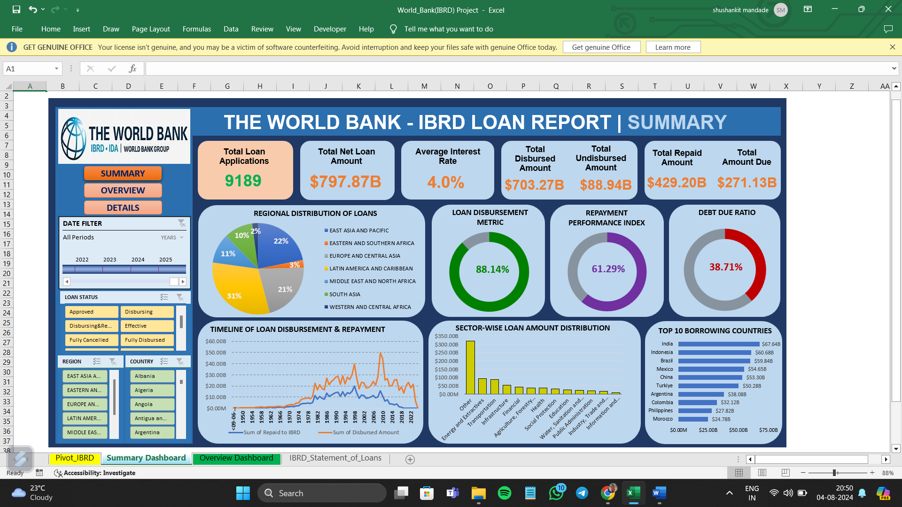

# World Bank IBRD Loans Analysis

## Project Overview
The World Bank IBRD Loans Analysis project aims to provide a comprehensive overview of the loans extended by the International Bank for Reconstruction and Development (IBRD). The project leverages Excel for data cleaning, validation, analysis, and visualization. The primary focus is on understanding the distribution, repayment performance, interest rates, and other key metrics associated with the IBRD loans. By analyzing this data, the project seeks to uncover patterns and insights that can inform better decision-making and policy formulation.

### Objectives:
- **Data Cleaning and Validation:** Ensure the dataset is accurate, complete, and formatted correctly for analysis.
- **Key Performance Indicators (KPIs):** Identify and calculate essential KPIs related to loan amounts, disbursements, repayments, and interest rates.
- **Regional and Sectoral Analysis:** Examine the distribution of loans across different regions and sectors to identify trends and key areas of focus.
- **Loan Type and Status Analysis:** Analyze the different types of loans and their current status to understand the portfolio composition and performance.
- **Visualizations:** Create clear and informative visualizations to present the findings effectively.

## Methodology

### Data Cleaning and Validation
1. **End of Period:** Cleaned using text to column function and changed its data type.
2. **Borrower:** Filled missing values with "unavailable data".
3. **Guarantor Country Code:** Filled missing values using the formula `=IF(ISBLANK(H2), D2, H2)`.
4. **Guarantor Country:** Filled missing values using the formula `=IF(ISBLANK(I2), E2, I2)`.
5. **Interest Rate:** Replaced null values with 0 and added a % suffix using custom format.
6. **Currency of Commitment:** Assumed USD and filled missing values.
7. **Amount Columns:** Converted to number data type.
8. **Date Columns:** Formatted to dd-mm-yyyy.
9. **Original Principal Amount:** Filled missing values using the formula `=IF(O5=0, IF(AND(R5=0, S5=0, Q5=0), O5, IF(AND(R5=0, S5=0), Q5, R5 + S5)), O5)`.
10. **Net Loan Amount:** Created a new column by subtracting "Cancelled Amount" from "Original Principal Amount".
11. **Sector Column:** Created using relevant keywords in the project name.

## Key Insights

### Performance Indicators
- **Total Principal Amount:** Comprehensive view of the original loan amounts.
- **Total Disbursed Amount:** Amounts actually disbursed to borrowers.
- **Total Undisbursed Amount:** Funds yet to be disbursed.
- **Total Repaid Amount:** Amounts repaid by borrowers to date.
- **Total Amount Due:** Outstanding amounts yet to be repaid.
- **Average Interest Rate:** Insights into the cost of borrowing.
- **Number of Active Loans:** Loans currently active and not fully repaid.
- **Regional Distribution of Loans:** Breakdown of loans across different geographical regions.
- **Top Borrowing Countries:** Countries with the highest loan amounts.
- **Loan Distribution by Sector:** Allocation of loans across various sectors.
- **Loan Type and Loan Status Analysis:** Analysis of loan types and their current status.

### Visual Insights
- **Total Principal Amount vs. Disbursed Amount:** Bar chart comparing the original loan amounts with the disbursed amounts.
- **Regional Distribution of Loans:** Pie chart showing the distribution of loans across different regions.
- **Top Borrowing Countries:** Bar chart highlighting the countries with the highest loan amounts.
- **Loan Distribution by Sector:** Pie chart indicating the loan allocation by sector.
- **Interest Rate Analysis:** Line chart depicting the average interest rates over time.

## Visualizations

## Usage
1. Open the `World_Bank_IBRD_Loans_Analysis.xlsx` file in Microsoft Excel.
2. Navigate through the various sheets to explore the data cleaning, analysis, and visualizations.
3. Interact with the pivot tables and charts to gain insights from the data.
4. For more details about dataset refer this file `Data_Dictionary IBRD and IDA Dataset Details.pdf`

## Reference
- https://data.worldbank.org/
- https://finances.worldbank.org/ (open finance data of world bank)
  
## License
This project is licensed under the MIT License - see the LICENSE file for details.

